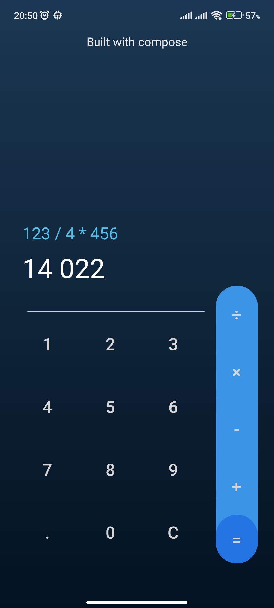

Compose Calculator

This is a sample calculator application implemented using Jetpack Compose.

  

Features

    UI layout using Jetpack Compose.

Getting Started

To run the calculator application on your local machine, follow these steps:

    Clone the repository:

    bash

    git clone git@github.com:itsaligadimi/built-with-compose.git

    Open the project in Android Studio.

    Build and run the application on an Android device or emulator.

Contributing

This repository serves as a collection of UI implementations built with Jetpack Compose. It aims to provide a diverse range of UI examples that showcase the capabilities and versatility of Compose.

Contributions to this repository are highly encouraged and appreciated. If you would like to contribute, you can:

    Implement additional UI examples using Jetpack Compose.
    Improve existing UI implementations by enhancing the functionality or design.
    Refactor code to follow best practices and improve maintainability.
    Fix bugs or issues found in the existing implementations.
    Add documentation, tutorials, or explanatory comments to enhance the educational value of the repository.

License

This project is licensed under the MIT License. See the LICENSE file for more details.

Acknowledgements

The calculator UI design and implementation are inspired by various online resources and tutorials.
Contact

If you have any questions, suggestions, or feedback, please feel free to contact the project maintainer:

Ali Gadimi
Email: aligadimi@outlook.com
GitHub: https://github.com/itsaligadimi