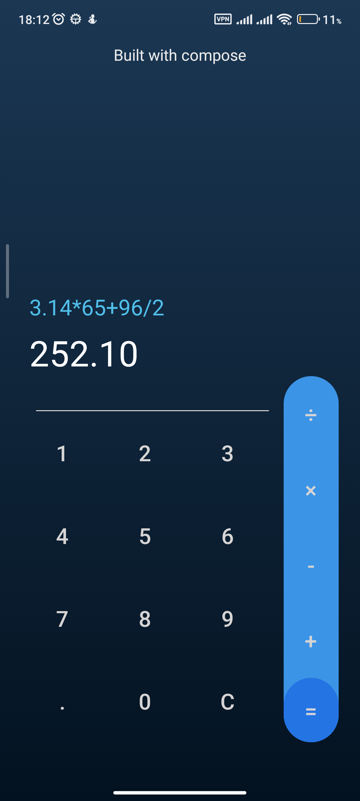

# Calculator - built with Compose

This is a sample calculator application implemented using Jetpack Compose.

  

## Features

* UI layout using Jetpack Compose.
* Basic State usage

## Getting Started

To run the calculator application on your local machine, follow these steps:

1. Clone the repository:

   `git clone git@github.com:itsaligadimi/built-with-compose.git`

2. Open the project in Android Studio.

3. Build and run the application on an Android device or emulator.